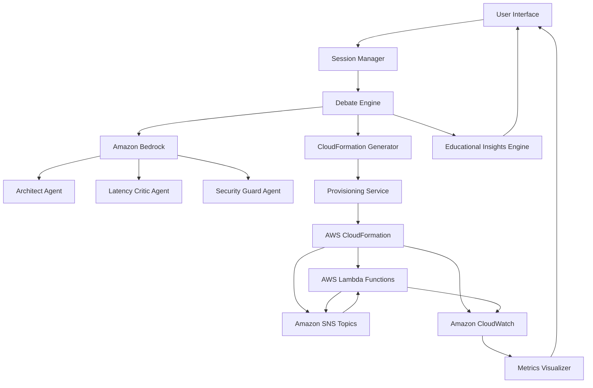

# Design Document: SochStack

## Overview

SochStack is an educational platform that teaches distributed systems design through interactive AI-powered simulation. The system employs a multi-agent architecture where specialized AI agents debate system designs, reach consensus, and then automatically provision mock infrastructure on AWS to demonstrate real-world performance characteristics.

The architecture follows a pipeline approach:
1. **Input Phase**: User provides system requirements
2. **Debate Phase**: AI agents propose, critique, and refine designs
3. **Consensus Phase**: Agents reach agreement on optimal design
4. **Generation Phase**: System generates CloudFormation templates
5. **Provisioning Phase**: Mock infrastructure is deployed to AWS
6. **Simulation Phase**: Synthetic workload demonstrates system behavior
7. **Visualization Phase**: Real-time metrics reveal bottlenecks and performance

This design emphasizes educational value by making the design process transparent and the performance implications visible.

## Architecture

### High-Level Architecture



### Component Layers

1. **Presentation Layer**: User interface for requirements input and metrics visualization
2. **Orchestration Layer**: Session management and workflow coordination
3. **Agent Layer**: Multi-agent system powered by Amazon Bedrock
4. **Generation Layer**: CloudFormation template synthesis
5. **Infrastructure Layer**: AWS services (Lambda, SNS, CloudWatch)
6. **Analytics Layer**: Metrics collection and bottleneck detection

## Components and Interfaces

### 1. Session Manager

**Responsibility**: Manages user sessions, persists state, and coordinates workflow progression.

**Interface**:
```python
class SessionManager:
    def create_session(user_id: str, requirements: str) -> Session:
        """Create a new design session with user requirements"""
        
    def get_session(session_id: str) -> Session:
        """Retrieve an existing session by ID"""
        
    def list_sessions(user_id: str) -> List[SessionSummary]:
        """List all sessions for a user"""
        
    def save_session(session: Session) -> None:
        """Persist session state to storage"""
        
    def delete_session(session_id: str) -> None:
        """Remove a session and its associated data"""
```

**Key Behaviors**:
- Generates unique session IDs using UUID
- Persists session state to DynamoDB or S3
- Tracks workflow stage (debate, provisioning, running, completed)
- Maintains references to CloudFormation stacks for cleanup

### 2. Debate Engine

**Responsibility**: Orchestrates multi-agent debate, tracks consensus, and manages debate rounds.

**Interface**:
```python
class DebateEngine:
    def initialize_agents(bedrock_client: BedrockClient) -> AgentSwarm:
        """Initialize the three specialized agents"""
        
    def start_debate(requirements: str, agents: AgentSwarm) -> DebateResult:
        """Begin the design debate process"""
        
    def conduct_round(proposal: DesignProposal, agents: AgentSwarm) -> RoundResult:
        """Execute one round of agent feedback"""
        
    def check_consensus(round_result: RoundResult) -> bool:
        """Determine if all agents approve the current proposal"""
        
    def get_debate_history(session_id: str) -> List[DebateRound]:
        """Retrieve the complete debate transcript"""
```

**Key Behaviors**:
- Limits debate to maximum 10 rounds to prevent infinite loops
- Tracks individual agent approval status
- Maintains structured debate history for educational insights
- Implements round-robin agent interaction pattern
- Declares consensus when all three agents approve

### 3. Agent Swarm (Amazon Bedrock Integration)

**Responsibility**: Manages individual AI agents with specialized roles and prompts.

**Interface**:
```python
class AgentSwarm:
    def get_architect() -> Agent:
        """Get the Architect agent instance"""
        
    def get_latency_critic() -> Agent:
        """Get the Latency Critic agent instance"""
        
    def get_security_guard() -> Agent:
        """Get the Security Guard agent instance"""

class Agent:
    def invoke(prompt: str, context: DebateContext) -> AgentResponse:
        """Send a prompt to the agent and get response"""
        
    def get_role() -> AgentRole:
        """Get the agent's specialized role"""
```

**Agent Specializations**:

- **Architect Agent**: 
  - Proposes system architectures
  - Suggests component decomposition
  - Recommends communication patterns
  - Revises designs based on feedback

- **Latency Critic Agent**:
  - Analyzes end-to-end latency
  - Identifies synchronous bottlenecks
  - Suggests caching and async patterns
  - Evaluates network hop counts

- **Security Guard Agent**:
  - Reviews authentication mechanisms
  - Checks data encryption requirements
  - Validates least-privilege access
  - Identifies security vulnerabilities

**Prompt Engineering**:
Each agent receives a system prompt defining its role, expertise, and evaluation criteria. The prompts include:
- Role definition and responsibilities
- Evaluation framework (what to look for)
- Output format (structured feedback)
- Examples of good and bad designs

### 4. CloudFormation Generator

**Responsibility**: Converts approved design proposals into valid AWS CloudFormation templates.

**Interface**:
```python
class CloudFormationGenerator:
    def generate_template(design: DesignProposal) -> CloudFormationTemplate:
        """Convert design to CloudFormation template"""
        
    def add_lambda_functions(template: Template, components: List[Component]) -> None:
        """Add Lambda function resources for each component"""
        
    def add_sns_topics(template: Template, connections: List[Connection]) -> None:
        """Add SNS topics for inter-component messaging"""
        
    def add_monitoring(template: Template, components: List[Component]) -> None:
        """Add CloudWatch dashboards and alarms"""
        
    def validate_template(template: CloudFormationTemplate) -> ValidationResult:
        """Validate template syntax and resource limits"""
```

**Key Behaviors**:
- Maps design components to Lambda functions
- Creates SNS topics for each inter-component connection
- Configures Lambda environment variables with simulated latencies
- Adds CloudWatch dashboards with key metrics
- Sets up alarms for latency thresholds
- Validates template against AWS limits (Lambda count, SNS topics)

**Template Structure**:
```yaml
Resources:
  # Lambda functions (one per component)
  ComponentAFunction:
    Type: AWS::Lambda::Function
    Properties:
      Runtime: python3.11
      Handler: index.handler
      Environment:
        Variables:
          SIMULATED_LATENCY_MS: "50"
          DOWNSTREAM_TOPIC_ARN: !Ref ComponentBTopic
  
  # SNS topics (one per connection)
  ComponentBTopic:
    Type: AWS::SNS::Topic
    
  # CloudWatch dashboard
  MetricsDashboard:
    Type: AWS::CloudWatch::Dashboard
```

### 5. Provisioning Service

**Responsibility**: Deploys and manages CloudFormation stacks for mock infrastructure.

**Interface**:
```python
class ProvisioningService:
    def provision_infrastructure(template: CloudFormationTemplate, session_id: str) -> StackInfo:
        """Deploy the CloudFormation stack"""
        
    def get_stack_status(stack_id: str) -> StackStatus:
        """Check the current status of a stack"""
        
    def wait_for_completion(stack_id: str, timeout_seconds: int) -> StackInfo:
        """Poll until stack creation completes or times out"""
        
    def teardown_infrastructure(stack_id: str) -> None:
        """Delete the CloudFormation stack and all resources"""
```

**Key Behaviors**:
- Uses AWS CloudFormation SDK to create stacks
- Polls stack status until CREATE_COMPLETE or failure
- Implements exponential backoff for status checks
- Captures stack outputs (Lambda ARNs, SNS topic ARNs)
- Handles rollback on provisioning failure
- Ensures complete cleanup on teardown

### 6. Mock Infrastructure (Lambda Functions)

**Responsibility**: Simulates distributed system components with realistic behavior.

**Lambda Function Logic**:
```python
def lambda_handler(event, context):
    # Simulate processing latency
    latency_ms = int(os.environ['SIMULATED_LATENCY_MS'])
    time.sleep(latency_ms / 1000.0)
    
    # Emit custom metrics
    cloudwatch.put_metric_data(
        Namespace='SochStack',
        MetricData=[{
            'MetricName': 'ProcessingLatency',
            'Value': latency_ms,
            'Unit': 'Milliseconds',
            'Dimensions': [{'Name': 'Component', 'Value': component_name}]
        }]
    )
    
    # Forward to downstream components
    if 'DOWNSTREAM_TOPIC_ARN' in os.environ:
        sns.publish(
            TopicArn=os.environ['DOWNSTREAM_TOPIC_ARN'],
            Message=json.dumps(event)
        )
    
    return {'statusCode': 200, 'body': 'Processed'}
```

**Key Behaviors**:
- Reads simulated latency from environment variables
- Sleeps to simulate processing time
- Publishes custom metrics to CloudWatch
- Forwards messages to downstream SNS topics
- Tracks invocation count and error rates

### 7. Workload Simulator

**Responsibility**: Generates synthetic traffic to demonstrate system behavior.

**Interface**:
```python
class WorkloadSimulator:
    def start_simulation(stack_info: StackInfo, rate_per_second: int) -> SimulationHandle:
        """Begin sending synthetic requests"""
        
    def adjust_rate(handle: SimulationHandle, new_rate: int) -> None:
        """Change the request rate dynamically"""
        
    def stop_simulation(handle: SimulationHandle) -> None:
        """Stop sending requests"""
```

**Key Behaviors**:
- Invokes entry-point Lambda functions at specified rate
- Generates realistic request payloads
- Tracks request IDs for end-to-end tracing
- Supports rate adjustment during simulation
- Runs in background thread or separate process

### 8. Metrics Visualizer

**Responsibility**: Displays real-time CloudWatch metrics and identifies bottlenecks.

**Interface**:
```python
class MetricsVisualizer:
    def fetch_metrics(stack_info: StackInfo, time_range: TimeRange) -> MetricsData:
        """Retrieve CloudWatch metrics for all components"""
        
    def identify_bottlenecks(metrics: MetricsData, thresholds: Thresholds) -> List[Bottleneck]:
        """Analyze metrics to find performance issues"""
        
    def render_dashboard(metrics: MetricsData, bottlenecks: List[Bottleneck]) -> Dashboard:
        """Create visual representation of system performance"""
```

**Key Behaviors**:
- Queries CloudWatch for custom metrics every 5 seconds
- Calculates p50, p95, p99 latencies per component
- Identifies components exceeding latency thresholds
- Visualizes message flow rates between components
- Highlights bottlenecks with visual emphasis
- Shows time-series graphs of key metrics

**Bottleneck Detection Algorithm**:
1. For each component, calculate average latency
2. Identify components with latency > threshold (e.g., 200ms)
3. Check if component has high error rate (> 1%)
4. Verify if component is on critical path
5. Rank bottlenecks by impact on end-to-end latency

### 9. Educational Insights Engine

**Responsibility**: Generates explanations and recommendations based on observed performance.

**Interface**:
```python
class InsightsEngine:
    def analyze_bottleneck(bottleneck: Bottleneck, design: DesignProposal, debate_history: List[DebateRound]) -> Insight:
        """Generate educational explanation for a bottleneck"""
        
    def suggest_improvements(bottleneck: Bottleneck) -> List[Recommendation]:
        """Provide actionable recommendations"""
        
    def link_to_debate(bottleneck: Bottleneck, debate_history: List[DebateRound]) -> List[DebateReference]:
        """Find relevant debate exchanges that predicted this issue"""
```

**Key Behaviors**:
- Correlates bottlenecks with design decisions
- References agent debate history to show predictions
- Generates plain-language explanations
- Suggests specific improvements (caching, async, parallelization)
- Provides links to learning resources
- Explains distributed systems concepts (CAP theorem, consistency models)

## Data Models

### Session
```python
@dataclass
class Session:
    session_id: str
    user_id: str
    requirements: str
    created_at: datetime
    updated_at: datetime
    status: SessionStatus  # DEBATING, PROVISIONING, RUNNING, COMPLETED, FAILED
    debate_result: Optional[DebateResult]
    stack_info: Optional[StackInfo]
    
@dataclass
class SessionSummary:
    session_id: str
    requirements_preview: str  # First 100 chars
    created_at: datetime
    status: SessionStatus
```

### Debate Models
```python
@dataclass
class DesignProposal:
    components: List[Component]
    connections: List[Connection]
    rationale: str
    version: int  # Increments with each revision
    
@dataclass
class Component:
    name: str
    type: ComponentType  # API_GATEWAY, SERVICE, DATABASE, CACHE, QUEUE
    estimated_latency_ms: int
    
@dataclass
class Connection:
    from_component: str
    to_component: str
    connection_type: ConnectionType  # SYNC, ASYNC, STREAM
    
@dataclass
class AgentResponse:
    agent_role: AgentRole
    approved: bool
    feedback: str
    suggested_changes: List[str]
    
@dataclass
class DebateRound:
    round_number: int
    proposal: DesignProposal
    responses: List[AgentResponse]
    consensus_reached: bool
    
@dataclass
class DebateResult:
    final_proposal: DesignProposal
    debate_history: List[DebateRound]
    consensus_reached: bool
    total_rounds: int
```

### Infrastructure Models
```python
@dataclass
class CloudFormationTemplate:
    template_body: str  # YAML or JSON
    parameters: Dict[str, str]
    
@dataclass
class StackInfo:
    stack_id: str
    stack_name: str
    status: str
    outputs: Dict[str, str]  # Lambda ARNs, SNS ARNs, etc.
    created_at: datetime
    
@dataclass
class StackStatus:
    status: str  # CREATE_IN_PROGRESS, CREATE_COMPLETE, etc.
    status_reason: Optional[str]
```

### Metrics Models
```python
@dataclass
class MetricsData:
    component_metrics: Dict[str, ComponentMetrics]
    time_range: TimeRange
    
@dataclass
class ComponentMetrics:
    component_name: str
    invocation_count: int
    error_count: int
    latency_p50: float
    latency_p95: float
    latency_p99: float
    throughput_per_second: float
    
@dataclass
class Bottleneck:
    component_name: str
    issue_type: BottleneckType  # HIGH_LATENCY, HIGH_ERROR_RATE, SATURATION
    severity: float  # 0.0 to 1.0
    impact_on_end_to_end_latency_ms: float
    
@dataclass
class Insight:
    bottleneck: Bottleneck
    explanation: str
    related_debate_rounds: List[int]
    recommendations: List[Recommendation]
    
@dataclass
class Recommendation:
    title: str
    description: str
    estimated_improvement: str
    learning_resources: List[str]
```


## Correctness Properties

*A property is a characteristic or behavior that should hold true across all valid executions of a system—essentially, a formal statement about what the system should do. Properties serve as the bridge between human-readable specifications and machine-verifiable correctness guarantees.*

### Property 1: Input Validation Consistency

*For any* input string (including empty, whitespace-only, or valid requirements), the validation function should consistently accept non-empty strings and reject empty or whitespace-only strings.

**Validates: Requirements 2.2**

### Property 2: Requirements Round-Trip Persistence

*For any* valid requirements string, storing it in a session and then retrieving the session should return the exact same requirements string.

**Validates: Requirements 2.4**

### Property 3: Design Proposal Generation

*For any* valid user requirements, the Architect_Agent should generate a design proposal containing at least one component and valid structure (components list, connections list, rationale).

**Validates: Requirements 3.1**

### Property 4: Debate Broadcast

*For any* design proposal, when presented to the debate engine, all three agents (Architect, Latency_Critic, Security_Guard) should receive and respond to the proposal.

**Validates: Requirements 3.2**

### Property 5: Feedback Persistence

*For any* agent feedback provided during a debate round, the feedback should be recorded in the debate history and retrievable for later reference.

**Validates: Requirements 3.5**

### Property 6: Debate Round Limit

*For any* debate session, regardless of whether consensus is reached, the number of debate rounds should never exceed the configured maximum (10 rounds).

**Validates: Requirements 3.7**

### Property 7: Consensus Detection

*For any* debate round where all three agents approve the proposal, the debate engine should declare consensus reached and finalize the design.

**Validates: Requirements 4.1, 4.2**

### Property 8: Fallback Design Availability

*For any* debate that reaches maximum rounds without consensus, the system should still return a design proposal (the best available) along with noted concerns from agents.

**Validates: Requirements 4.3**

### Property 9: Independent Approval Tracking

*For any* debate round, the approval status of each agent should be tracked independently, such that one agent's approval does not affect another agent's status.

**Validates: Requirements 4.4**

### Property 10: CloudFormation Template Validity

*For any* approved design proposal, the generated CloudFormation template should pass AWS template syntax validation.

**Validates: Requirements 5.5**

### Property 11: Template Resource Completeness

*For any* design proposal with N components and M connections, the generated CloudFormation template should contain at least N Lambda function resources, M SNS topic resources, and monitoring resources (dashboard and alarms).

**Validates: Requirements 5.2, 5.3, 5.4**

### Property 12: Template Accessibility

*For any* generated CloudFormation template, the template should be retrievable from the session after generation completes.

**Validates: Requirements 5.6**

### Property 13: Provisioning Error Reporting

*For any* provisioning failure, the system should return an error report containing diagnostic information about what failed.

**Validates: Requirements 6.5**

### Property 14: Configurable Request Rate

*For any* valid request rate configuration (requests per second), the workload simulator should generate requests at approximately that rate (within 10% tolerance).

**Validates: Requirements 7.2**

### Property 15: Simulated Latency Accuracy

*For any* Lambda function with configured simulated latency L milliseconds, the actual processing time should be within 20% of L (to account for execution overhead).

**Validates: Requirements 7.3**

### Property 16: Message Flow Integrity

*For any* Lambda function configured with a downstream SNS topic, when the function completes processing, it should publish a message to that topic.

**Validates: Requirements 7.4**

### Property 17: Metrics Emission Completeness

*For any* Lambda invocation, the function should emit at least one custom metric to CloudWatch (processing latency).

**Validates: Requirements 7.5**

### Property 18: Component Metrics Coverage

*For any* component in the provisioned infrastructure, the metrics visualizer should display latency measurements and message flow rates for that component.

**Validates: Requirements 8.2, 8.4**

### Property 19: Bottleneck Highlighting

*For any* component with latency exceeding the defined threshold, the metrics visualizer should mark that component as highlighted/emphasized.

**Validates: Requirements 8.3, 8.5**

### Property 20: Metrics Update Frequency

*For any* running simulation, the metrics visualizer should fetch and update metrics at intervals of 5 seconds or less.

**Validates: Requirements 8.6**

### Property 21: Bottleneck Explanation Generation

*For any* identified bottleneck, the insights engine should generate an explanation containing the root cause and at least one recommendation.

**Validates: Requirements 9.1, 9.2**

### Property 22: Debate History Linkage

*For any* generated insight about a bottleneck, the insight should reference at least one debate round from the session's debate history.

**Validates: Requirements 9.3**

### Property 23: Infrastructure Cleanup Completeness

*For any* provisioned CloudFormation stack, when cleanup is requested, the stack should be deleted and verification should confirm no resources remain.

**Validates: Requirements 10.2, 10.3**

### Property 24: Cleanup Failure Reporting

*For any* cleanup operation that fails, the system should return a list of resources that remain and provide cleanup instructions.

**Validates: Requirements 10.4**

### Property 25: Session ID Uniqueness

*For any* set of created sessions, all session IDs should be unique (no duplicates).

**Validates: Requirements 11.1**

### Property 26: Session State Round-Trip

*For any* active session with debate history, approved design, and infrastructure state, persisting the session and then restoring it should produce an equivalent session with all data intact.

**Validates: Requirements 11.2, 11.4**

### Property 27: Agent Retry Behavior

*For any* agent invocation that fails, the debate engine should retry the request up to 3 times before giving up.

**Validates: Requirements 12.1**

### Property 28: Graceful Agent Failure Handling

*For any* agent that fails after all retries, the debate engine should continue with the remaining agents and note the missing input in the debate history.

**Validates: Requirements 12.2**

### Property 29: Error Logging and User Messaging

*For any* AWS service call failure, the system should both log the error (for debugging) and present a user-friendly error message (for the user).

**Validates: Requirements 12.3, 12.4**

## Error Handling

### Agent Communication Errors

**Scenario**: Amazon Bedrock agent fails to respond or returns malformed data

**Handling**:
1. Implement exponential backoff retry (3 attempts)
2. Log detailed error information for debugging
3. If all retries fail, mark agent as unavailable for current round
4. Continue debate with remaining agents
5. Note missing agent input in debate history
6. Present user-friendly message: "One agent is temporarily unavailable, continuing with available agents"

### AWS Service Failures

**Scenario**: CloudFormation, Lambda, SNS, or CloudWatch API calls fail

**Handling**:
1. Catch AWS SDK exceptions
2. Log full error details including request ID
3. Determine if error is retryable (throttling, temporary) or permanent (permissions, limits)
4. For retryable errors: implement exponential backoff
5. For permanent errors: present actionable error message to user
6. Maintain system state consistency (don't leave partial resources)

### Provisioning Failures

**Scenario**: CloudFormation stack creation fails

**Handling**:
1. CloudFormation automatically rolls back on failure
2. Capture stack events to identify root cause
3. Parse error messages for common issues (IAM permissions, resource limits, syntax errors)
4. Present diagnostic information to user with suggested fixes
5. Update session status to FAILED
6. Ensure no orphaned resources remain

### Validation Errors

**Scenario**: User input or generated templates fail validation

**Handling**:
1. Validate early (fail fast principle)
2. Provide specific error messages indicating what failed validation
3. For template validation: use AWS CloudFormation validate-template API
4. For user input: check for empty strings, excessive length, invalid characters
5. Return validation errors before attempting expensive operations

### Timeout Handling

**Scenario**: Operations exceed expected duration

**Handling**:
1. Set reasonable timeouts for all external calls:
   - Agent invocations: 30 seconds
   - CloudFormation operations: 10 minutes
   - Metrics queries: 10 seconds
2. When timeout occurs, cancel operation if possible
3. Log timeout event with context
4. Present timeout error to user with option to retry
5. For long-running operations (provisioning), provide progress updates

### Data Consistency

**Scenario**: Session state becomes inconsistent due to partial failures

**Handling**:
1. Use transactional updates where possible
2. Implement state machine for session status transitions
3. Validate state before transitions
4. If inconsistency detected, attempt automatic recovery
5. If recovery fails, mark session as corrupted and prevent further operations
6. Provide session export for debugging

## Testing Strategy

### Unit Testing

Unit tests focus on specific examples, edge cases, and error conditions for individual components:

**Session Manager**:
- Test session creation with valid and invalid inputs
- Test session ID generation produces valid UUIDs
- Test session retrieval with non-existent IDs returns appropriate error
- Test session deletion removes all associated data

**Debate Engine**:
- Test initialization with mock Bedrock client
- Test single debate round with mock agent responses
- Test consensus detection with all agents approving
- Test max rounds limit enforcement
- Test handling of agent failures

**CloudFormation Generator**:
- Test template generation with minimal design (1 component, 0 connections)
- Test template generation with complex design (10 components, 15 connections)
- Test Lambda resource creation with correct properties
- Test SNS topic creation with correct subscriptions
- Test monitoring resource inclusion

**Metrics Visualizer**:
- Test bottleneck detection with metrics above threshold
- Test bottleneck detection with metrics below threshold
- Test metrics parsing from CloudWatch response format
- Test dashboard rendering with empty metrics
- Test dashboard rendering with multiple bottlenecks

**Insights Engine**:
- Test explanation generation for high-latency bottleneck
- Test explanation generation for high-error-rate bottleneck
- Test recommendation generation includes actionable items
- Test debate history linking finds relevant rounds

### Property-Based Testing

Property tests verify universal properties across many generated inputs. Each test should run a minimum of 100 iterations.

**Configuration**:
- Use Hypothesis (Python), fast-check (TypeScript), or QuickCheck (Haskell) depending on implementation language
- Configure minimum 100 iterations per property test
- Use appropriate generators for domain types (session IDs, requirements strings, design proposals)
- Tag each test with format: `Feature: soch-stack, Property N: [property text]`

**Property Test Examples**:

```python
# Property 1: Input Validation Consistency
@given(st.text())
def test_input_validation_consistency(input_string):
    """Feature: soch-stack, Property 1: Input validation consistency"""
    result = validate_requirements(input_string)
    is_empty_or_whitespace = len(input_string.strip()) == 0
    assert result.is_valid == (not is_empty_or_whitespace)

# Property 2: Requirements Round-Trip Persistence
@given(st.text(min_size=1).filter(lambda s: len(s.strip()) > 0))
def test_requirements_round_trip(requirements):
    """Feature: soch-stack, Property 2: Requirements round-trip persistence"""
    session = create_session(user_id="test", requirements=requirements)
    save_session(session)
    restored = get_session(session.session_id)
    assert restored.requirements == requirements

# Property 6: Debate Round Limit
@given(st.text(min_size=1), st.integers(min_value=1, max_value=20))
def test_debate_round_limit(requirements, max_rounds):
    """Feature: soch-stack, Property 6: Debate round limit"""
    debate_engine = DebateEngine(max_rounds=max_rounds)
    result = debate_engine.start_debate(requirements, mock_agents)
    assert result.total_rounds <= max_rounds

# Property 25: Session ID Uniqueness
@given(st.lists(st.text(min_size=1), min_size=10, max_size=100))
def test_session_id_uniqueness(requirements_list):
    """Feature: soch-stack, Property 25: Session ID uniqueness"""
    sessions = [create_session("user", req) for req in requirements_list]
    session_ids = [s.session_id for s in sessions]
    assert len(session_ids) == len(set(session_ids))  # All unique
```

### Integration Testing

Integration tests verify interactions between components and with AWS services:

**Mock AWS Services**:
- Use moto library (Python) or localstack for AWS service mocking
- Mock Bedrock, CloudFormation, Lambda, SNS, CloudWatch
- Verify correct API calls are made with correct parameters

**End-to-End Flows**:
- Test complete flow: requirements → debate → template → provision → simulate → visualize
- Test session save and restore across workflow stages
- Test cleanup removes all provisioned resources
- Test error recovery at each stage

**Performance Testing**:
- Test workload simulator can achieve target request rates
- Test metrics visualizer updates within 5-second window
- Test debate completes within reasonable time (< 5 minutes)
- Test system handles concurrent sessions

### Manual Testing Checklist

Since this is an educational tool, manual testing ensures good user experience:

- [ ] Verify agent debate is understandable and educational
- [ ] Verify metrics visualizations are clear and informative
- [ ] Verify bottleneck explanations are accurate and helpful
- [ ] Verify error messages are user-friendly
- [ ] Verify CloudFormation templates are readable
- [ ] Test with various requirement types (API, data pipeline, microservices)
- [ ] Verify cleanup leaves no orphaned AWS resources
- [ ] Test session restoration preserves all context
